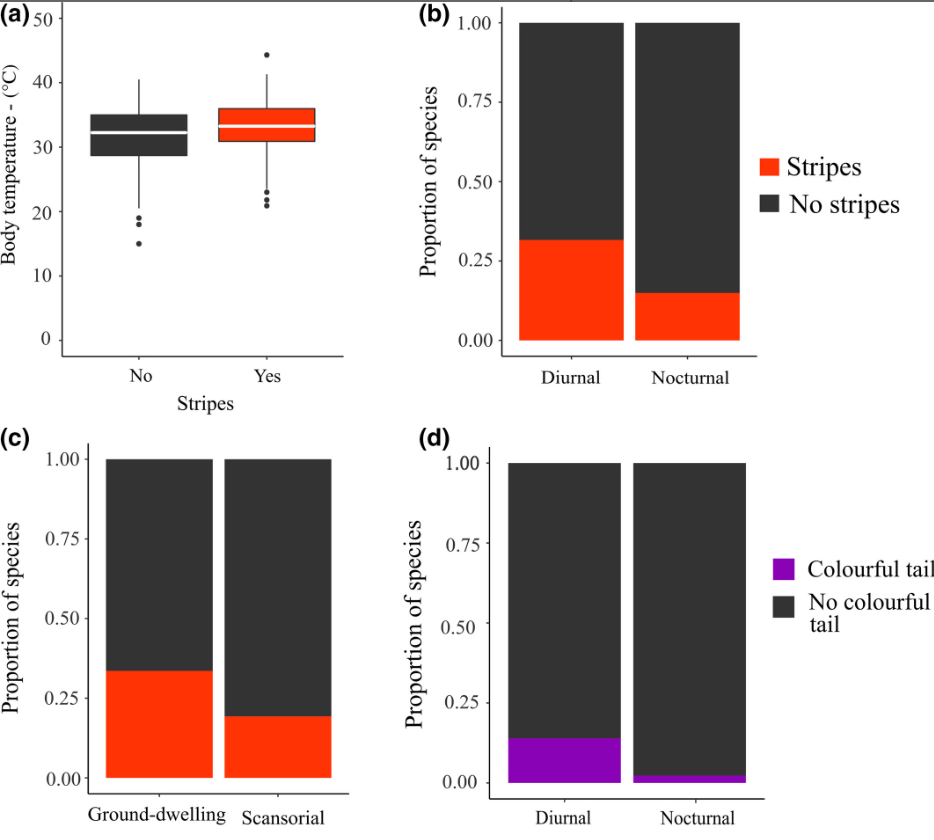

# Reanalysis of Murali et al. (2018): Grab my tail: evolution of dazzle stripes and colourful tails in lizards

*Emiley Garcia-Zych*

*December 14, 2023*

<center>

<p></p>

</center>

<br>

## Introduction

In this document, I outline the reanalysis of Murali et al. (2018), who examines the occurrence of longitudinal stripes and colorful tails in lizards. The researchers aim to understand the ecological factors associated with the evolution of tail stripes.

Experimental studies have previously suggested that colorful tails may serve as a distraction or deflection mechanism, potentially increasing the lizard's chances of escape by sacrificing a less vital part of their body. Additionally, longitudinal body stripes in moving lizards were proposed to redirect predators' strikes toward the tail through a phenomenon called the 'motion dazzle' effect.

However, despite these experimental findings, the ecological factors influencing the evolution of such colorations were not well-explored. The researchers conducted a study using comparative methods and considered eco-physiological variables such as caudal autotomy (ability to lose the tail), diel activity (activity during the day), microhabitat, and body temperature.

Their data set (ecological_data.csv) has data related to caudal autotomy, diel activity, microhabitat, and body temperature. This data was used in both figure 1 and figure 2. The Coloration (10/3 volunteers) gave information regarding the physical coloring and tail presence of the lizards as provided by volunteers. The results indicate that both longitudinal stripes and colorful tails are associated with diurnal (daytime) activity and the ability to lose the tail. Striped species are more likely to be ground-dwelling and have higher body temperatures compared to stripeless species, highlighting a connection between stripes and a mobility-driven rapid escape strategy. The study suggests that stripes and colorful tails have evolved together in a correlated fashion multiple times, indicating a potential link in their functions.

## Outline of Research & My Replication

In their analysis, they perform a series of descriptive and interpretive analyses. These are visualized in a series of graphics. I plan to replicate

1.  figure 2. Correlation between discrete traits (caudal autotomy, stripes, colourful tail, diel activity and habitat).

2.  table S5. Two-pair method: Results of the pairwise correlation analyses between discrete eco-physiological variables and (a) striped body and (b) colourful tail.

### Research Methods

#### Data Collection

The data set on lizard body and tail coloration represents 1622 species under 36 lizard families. Color patterns were scored by three volunteers independently based on 7907 images. Presence or absence of color traits were scored as follows:

-   *Stripes:* clearly visible stripes from the top of snout to tail base. If present, scored as Lateral, Dorsal, or both

    -   *Lateral:* ran along sides of the body

    -   *Dorsal:* restricted to the dorsal body parts

-   *Colourful tail:* criteria (1) the tail color was either red, blue or green, and (2) the tail color was different from the body.

    -   *Red Tail*

    -   *Blue Tail*

    -   *Green Tail*

This procedure was then repeated for 10 additional volunteers and strong concordance was found. For the analysis provided, the data was taken from the 3 volunteer data.

To test the association between caudal autotomy and protective coloration, data was collected regarding diel activity, species-specific body temperature, and habitat.

-   *Caudal Autotomy:* the ability of a lizard to detach and regrow a tail when damage has occurred.

-   *Diel activity:* nocturnal (1) verus diurnal (0).

-   *Habitat:* ground-dwelling (0) versus scansorial (1).

-   *Body Temperature:* measured when the lizard was active.

#### 1) Ancestral State Reconstruction for Binary Coloration Traits

(i) Bayesian stochastic character mapping using the function *make.simmap* from *phytools*

(ii) corHMM-based maximum-likelihood method

#### 2) Identifying correlation between discrete traits

-   using the software Bayestraits, implemented a reversible jump Markov chain method to obtain parameter estimates from different evolutionary models

    -   *independent:* assumes there is no correlation

    -   *dependent:* assumes there is correlation

    -   \*all analyses were performed for 10 million iterations with a burn-in of 1 million to avoid including values before MCMC chain convergence.

#### 3) Analyzing the Output

-   using Tracer v 1.6 to confirm convergence

-   All runs were assumed to have converged because the effective sample size of all parameters was \>200.

-   calculated the log Bayes factor in Tracer for each pair of models.

    -   a high log Bayes factor indicates support for dependent over independent

-   performed phylogenetic logistic regression using the function *phyloglm* in package *phylolm* to account for the effect of body size.

-   coded all the coloration states as separate binary variables and we compared the log Bayes factor values computed for each pair of binary traits against other possible pairwise combinations to check which of the pairwise combinations fitted the data best.

#### 4) Phylogenetic path analysis

-   employed the d separation method using the R package *phylopath* employing a PLR approach. The models were ranked based on the C-statistics information criterion.

#### 5) Correlation between stripes and body temp

-   employed phylogenetic generalized least squares regression using the *nlme* and *geiger* packages. Data was fitted using three evolutionary models (Ornstein-Uhlenbeck, Brownian motion and estimated lambda model), and best fit was based on the Akaike weights.

### My Replication

#### *Figure 2: Correlation between discrete traits (caudal autotomy, stripes, colourful tail, diel activity and habitat) (Descriptive Statistics)*

1.  Load and clean data to remove incomplete samples.

2.  Combine data so physical description data is in the same table as ecological data.

3.  Create a boxplot showing median and interquartile range of lizard body temperature.

4.  Create a graph showing proportion of striped and non-striped species which are nocturnal or diurnal.

5.  Create a graph showing the proportion of striped and non-striped which are ground dwelling or scansorial.

6.  Create a graph showing the proportion of species with and without colorful tails that are nocturnal or diurnal.

#### *Table S5: Results of the pairwise correlation analyses between discrete eco-physiological variables and (a) striped body and (b) colourful tail.*

1.  Create data frame with columns for the eco-physiological variables, 'stripes', and 'colorful tail'
2.  Run pairwise correlation analyses variable combinations. Use pearson analysis.
3.  Print results.
4.  Analyze results. (Values closer to +/- 1 indicate positive or negative association between the two factors. As the correlation coefficient value goes towards 0, the relationship gets weaker.)

## **Figure 2: Plots depicting association between defensive coloration and Eco-physiological variables.**

1.  Download necessary packages.

```{r}
library(phytools)
library(dplyr)
```

2.  Combine data so physical description data is in the same table as ecological data.

```{r}
#Load eco_data
data <- read.csv("Data_file.xls - Ecological_data.csv")
eco_data <- na.omit(data)
eco_data <- eco_data[,-1]

# Load physical description data
col3vol <- read.csv("Data_file.xls - Coloration (Three voulnteers).csv")
col3vol <- na.omit(col3vol)

# Sum the values in each row
stripes_sum <- rowSums(col3vol[, 2:7])
# Create a new data frame
stripes <- data.frame(
 Species.name = col3vol$Species.name,
  Stripes = ifelse(stripes_sum == 0, 0, 1)
)
color_sum <- rowSums(col3vol[, 8:16])
colorful <- data.frame(Species.name = col3vol$Species.name, Color = ifelse(color_sum == 0, 0, 1))
phys_char_df <- merge(stripes, colorful, by = "Species.name", all = TRUE)

# Merge data frames based on "species.name"
merged_df <- merge(eco_data, phys_char_df, by = "Species.name", all = TRUE)
# Filter out rows that were not changed (not present in both data frames)
changed_rows <- complete.cases(merged_df)
final_df <- merged_df[changed_rows, ]

# Display the final merged and filtered data frame
head(final_df)
```

3.  Create a boxplot showing median and interquartile range of lizard body temperature.

*Boxplots showing median and interquartile range of lizard body temperature; outliers are shown as black circles (P = 0.0029).*

```{r}
library (ggplot2)
#create a boxplot with outliers shown as black circles 
# Box plot with two boxes for stripes value = 1 and stripes value = 0
boxplot(Body.temperature ~ Stripes, data = final_df,
        main = "(a)",
        xlab = "Stripes",
        ylab = "Body Temperature (°C)",
        ylim = c(0, 50),
        col = c("gray", "red"),  # Colors for the boxes
        border = "darkblue",  # Border color
        outlier.col = "black",  # Color of outliers
        pch = 16  # Symbol for outliers
)
```

4.  Create a graph showing proportion of striped and non-striped species which are nocturnal or diurnal.

```{r}
# Calculate the proportions
proportions <- prop.table(table(final_df$Diel.activity..Nocturnal.1..Diurnal.0., final_df$Stripes), margin = 1)

# Convert proportions to a data frame
proportions_df <- as.data.frame(proportions)

# Reshape the data for plotting
proportions_long <- reshape2::melt(proportions_df)

# Plot using ggplot2
ggplot(proportions_long, aes(x = Var1, y = value, fill = factor(Var2))) +
  geom_bar(stat = "identity") +
  labs(title = "(b)", x = "Activity (Diurnal = 0, Nocturnal = 1)", y = "Proportion of Species") +
  scale_fill_manual(values = c("gray", "red"), name = "Stripes? (No = 0, Yes = 1)") +
  theme_minimal()
```

5.  Create a graph showing the proportion of striped and non-striped which are ground dwelling or scansorial.

```{r}
# Calculate the proportions
proportions <- prop.table(table(final_df$Habitat..Scansorial.1..Ground.dwelling.0., final_df$Stripes), margin = 1)

# Convert proportions to a data frame
proportions_df <- as.data.frame(proportions)

# Reshape the data for plotting
proportions_long <- reshape2::melt(proportions_df)

# Plot using ggplot2
ggplot(proportions_long, aes(x = Var1, y = value, fill = factor(Var2))) +
  geom_bar(stat = "identity") +
  labs(title = "(c)", x = "Habitat (Ground Dwelling = 0, Scansorial = 1)", y = "Proportion of Species") +
  scale_fill_manual(values = c("gray", "red"), name = "Stripes? (No = 0, Yes = 1)") +
  theme_minimal()
```

6.  Create a graph showing the proportion of species with and without colorful tails that are nocturnal or diurnal.

*Proportion of species with and without colourful tail which are nocturnal or diurnal*

```{r}
# Calculate the proportions
proportions <- prop.table(table(final_df$Diel.activity..Nocturnal.1..Diurnal.0., final_df$Color), margin = 1)

# Convert proportions to a data frame
proportions_df <- as.data.frame(proportions)

# Reshape the data for plotting
proportions_long <- reshape2::melt(proportions_df)

# Plot using ggplot2
ggplot(proportions_long, aes(x = Var1, y = value, fill = factor(Var2))) +
  geom_bar(stat = "identity") +
  labs(title = "(d)", x = "Activity (Diurnal = 0, Nocturnal = 1)", y = "Proportion of Species") +
  scale_fill_manual(values = c("gray", "purple"), name = "Colourful tail? (No = 0, Yes = 1)") +
  theme_minimal()
```

Figure 2 from the article:



## Table S5. Results of the pairwise correlation analyses between discrete eco-physiological variables and (a) striped body and (b) colourful tail.

1.  Create data frame with columns for the eco-physiological variables, 'stripes', and 'colorful tail'

    ```{r}
    head(final_df)
    ```

2.  Run pairwise correlation analyses variable combinations. Use pearson analysis.

    ```{r}
    #stripes versus habitat/cautal/color
    cor_stripes_habitat <- cor.test(final_df$Stripes, final_df$Habitat..Scansorial.1..Ground.dwelling.0., method = "pearson")
    cor_stripes_cautal <- cor.test(final_df$Stripes, final_df$Cautal.autotomy..Yes.1.No.0., method = "pearson")
    cor_stripes_color <- cor.test(final_df$Stripes, final_df$Color, method = "pearson")

    #color versus habitat/cautal
    cor_color_habitat <- cor.test(final_df$Color, final_df$Habitat..Scansorial.1..Ground.dwelling.0., method = "pearson")
    cor_color_cautal <- cor.test(final_df$Color, final_df$Cautal.autotomy..Yes.1.No.0., method = "pearson")

    ```

3.  Print results.

```{r}
cor_stripes_habitat
cor_stripes_cautal
cor_stripes_color
cor_color_habitat
cor_color_cautal
```

4.  Analyze results. (Values closer to +/- 1 indicate positive or negative association between the two factors. As the correlation coefficient value goes towards 0, the relationship gets weaker.)

-   Stripes \~ Habitat Usage (Scansorial = 1, Ground-Dwelling = 0)

    > -0.1163657

-   Stripes \~ Caudal Anatomy (Yes = 1, No= 0)

    > 0.4179749

<!-- -->

-   Stripes \~ Color (Colorful Tail = 1, No Colorful Tail = 0)

    > 0.3524086

-   Color \~ Habitat Usage (Scansorial = 1, Ground-Dwelling = 0)

    > -0.1045659

<!-- -->

-   Color \~ Caudal Anatomy (Yes = 1, No= 0)

    > 0.2492356

From these results, there is a week association between stripes & habitat usage, colorful tail and habitat usage, and color and caudal anatomy. There is a stronger association between stripes and caudal anatomy and stripes and having a colorful tail. This is in line with the researcher's hypothesis that stripes and colorful tails have to do with avoiding attacks from prey and are in line with deflecting attacks to parts of the body that can be regenerated. The researchers used the p-values as comparative measures and came to the same conclusions.


